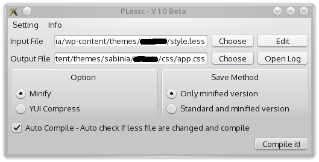

#Plessc
Plessc is a gui frontend for lessc (or another compiler).  
This software require:  
* Python 3
* PyQT
* lessc (node-less on many distro)
* All OS! ( *unix better)

#ScreenShot

#Feature
* Log readable (printed also in the console)
* Open the less file with the editor choosen
* Can be opened all less file on the folder of the file choosen 
* Support minify and yui-compress of lessc
* Save a development version and a minimized (using the option)
* Auto check if file it's modified and compile

#Run

Execute: pless.py